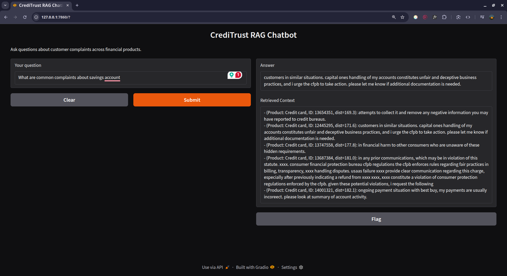

# Intelligent Complaint Analysis Chatbot (KAIM-5, Week 6)

A Retrieval-Augmented Generation (RAG) chatbot for CrediTrust Financial that transforms unstructured customer complaints into actionable insights.

**Built with:**
- **Data preprocessing & EDA:** [`src/eda_preprocessing.py`](src/eda_preprocessing.py)
- **Text chunking & embedding:** [`src/chunk_and_embed.py`](src/chunk_and_embed.py)
- **FAISS vector store:** [`vector_store/faiss_index/index.faiss`](vector_store/faiss_index/index.faiss), [`vector_store/faiss_index/metadata.csv`](vector_store/faiss_index/metadata.csv)
- **RAG core logic:** [`src/run_rag.py`](src/run_rag.py) using Sentence-Transformers & FLAN-T5
- **Interactive UI:** [`src/app.py`](src/app.py) with Gradio

---

## 📁 Repository Structure

```
.
├── data
│   ├── filtered_complaints.csv      # Cleaned & filtered dataset
│   └── raw/complaints.csv          # Original CFPB data
├── images
│   └── gradio_demo.png             # Screenshot of the chat interface
├── notebooks                       # (Optional) Jupyter notebooks
├── requirements.txt                # Python dependencies
├── README.md                       # This file
├── src
│   ├── app.py                      # Gradio UI for the RAG chatbot
│   ├── chunk_and_embed.py          # Text chunking + FAISS indexing
│   ├── eda_preprocessing.py        # EDA & data cleaning
│   ├── retrieve.py                 # Retrieval functions (top-k search)
│   └── run_rag.py                  # End-to-end RAG script (embed→retrieve→generate)
└── vector_store
    └── faiss_index
        ├── index.faiss             # FAISS index file
        └── metadata.csv            # Chunk metadata for retrieval
```

---

## ⚙️ Setup

1. **Clone the repo**
   ```bash
   git clone https://github.com/HTGit63/kaim-5-week-6.git
   cd kaim-5-week-6
   ```

2. **Create & activate a virtual environment**
   ```bash
   python3 -m venv .venv
   source .venv/bin/activate       # macOS/Linux
   # .venv\Scripts\activate        # Windows PowerShell
   ```

3. **Install dependencies**
   ```bash
   pip install -r requirements.txt
   ```

---

## 🚀 Running Each Stage

### 1. EDA & Preprocessing

```bash
python src/eda_preprocessing.py
```
- Loads `data/raw/complaints.csv`, performs EDA, filters to five products, cleans narratives, and writes `data/filtered_complaints.csv`.

### 2. Chunking & Embedding

```bash
python src/chunk_and_embed.py
```
- Chunks cleaned narratives, embeds them with a Sentence-Transformer, and indexes into FAISS (`vector_store/faiss_index`).

### 3. Retrieval & Generation (RAG Core)

```bash
python src/run_rag.py
```
- Interactive prompt: type a question, retrieves top 5 chunks, generates an answer with FLAN-T5.

### 4. Interactive Chat UI

```bash
python src/app.py
```
- Launches a Gradio demo at `http://127.0.0.1:7860`.
- Users can ask questions and see answers with source chunks.

---

## 📷 UI Showcase



---

## 📖 How It Works

1. **Data Prep:** Clean & filter narratives for five core products.
2. **Chunking:** Split long text into overlapping chunks for context preservation.
3. **Embedding & Indexing:** Convert text chunks to vectors and build a FAISS index.
4. **Retrieval:** Embed user query, search FAISS for top-k relevant chunks.
5. **Generation:** Pass context + question into FLAN-T5 (local model) to generate an answer.
6. **UI:** Gradio app exposes the full pipeline in a user-friendly chat interface.

---

## 🔖 License & Acknowledgments

- Data sourced from the CFPB dataset.
- Built with [Sentence-Transformers](https://www.sbert.net/), [FAISS](https://github.com/facebookresearch/faiss), and [Gradio](https://gradio.app).

